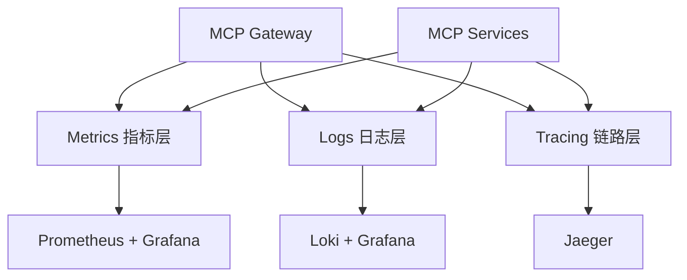
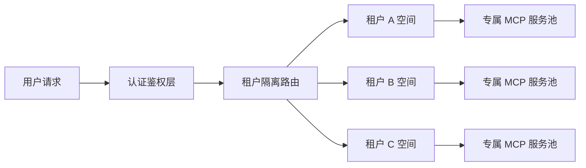
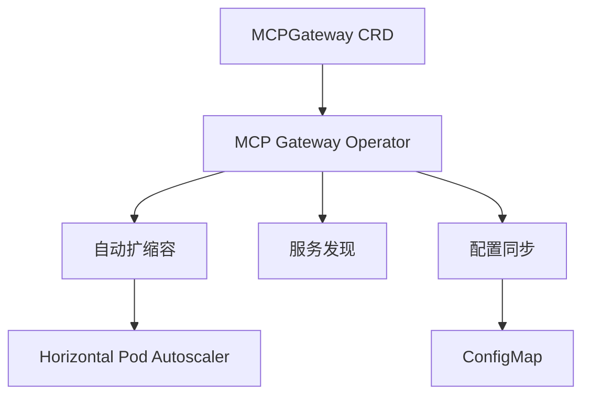
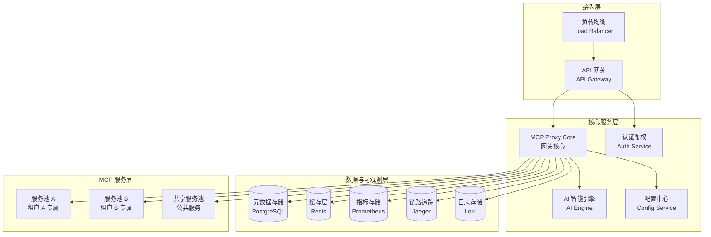

# MCP Gateway 前沿性迭代方案

## 1. 项目现状分析

### 1.1 当前架构优势

MCP Gateway 是一个面向 **Model Context Protocol (MCP)** 的企业级网关聚合方案，具有以下核心优势：

- **多 Server 聚合能力**：自动聚合 Tools、Prompts 和 Resources
- **全平台传输兼容**：支持 Streamable HTTP 与 SSE 模式
- **现代化 UI 设计**：内置全站汉化 Dashboard
- **自动化工作流**：内置提交、安全审计及发布工作流
- **多协议支持**：支持 stdio、sse 和 streamable-http 三种传输模式

### 1.2 技术栈

| 层级 | 技术栈 |
|------|--------|
| **网关核心** | Go + mcp-go |
| **前端 UI** | Vanilla HTML + Tailwind |
| **容器编排** | Docker Compose |
| **配置管理** | JSON + 环境变量 |

### 1.3 当前集成服务

- **stitch** (HTTP)：UI 设计与代码生成
- **github** (Stdio)：仓库操作 (PR/Issue)
- **chart** (Stdio)：图表生成
- **fetch** (Stdio)：网页爬取
- **douyin** (SSE)：抖音下载与文案提取
- **jules** (SSE)：AI 代理服务

### 1.4 面临的挑战与痛点

1. **可观测性不足**：缺乏详细的调用链路追踪、性能监控、日志分析
2. **动态配置受限**：配置变更需要重启服务，无法热更新
3. **多租户隔离缺失**：目前是单租户架构，无法支持多用户独立空间
4. **插件生态不完善**：缺少标准化的插件注册和发现机制
5. **AI 驱动能力薄弱**：没有利用 AI 进行智能优化和决策辅助
6. **安全审计不完整**：缺少详细的操作审计和异常检测
7. **扩展性瓶颈**：水平扩展能力有限

---

## 2. 前沿性迭代方向

### 2.1 AI 驱动的智能网关

#### 核心特性

| 特性 | 描述 |
|------|------|
| **智能路由** | AI 根据请求类型自动选择最优 MCP 服务 |
| **流量预测** | 基于历史数据预测服务负载，提前扩容 |
| **异常检测** | AI 实时监控服务异常，自动降级或熔断 |
| **自动优化** | 学习调用模式，优化工具组合和调用顺序 |

#### 技术实现

```go
// AI 驱动的智能路由引擎示例
type AIRouter struct {
    model     AIModel
    history   []CallRecord
    optimizer *TrafficOptimizer
}

func (r *AIRouter) Route(request *mcp.CallToolRequest) (string, error) {
    // 1. 分析请求特征
    features := r.extractFeatures(request)
    
    // 2. AI 预测最优服务
    prediction := r.model.Predict(features)
    
    // 3. 结合实时状态决策
    return r.makeDecision(prediction, r.getRealTimeStatus())
}
```

### 2.2 企业级可观测性体系

#### 三层可观测架构



#### 核心指标设计

| 指标类别 | 具体指标 | 用途 |
|----------|----------|------|
| **服务层** | 服务健康状态、连接次数、重连次数 | 服务可用性监控 |
| **调用层** | QPS、延迟分布、错误率、工具调用次数 | 性能分析 |
| **资源层** | 内存占用、CPU 使用率、并发连接数 | 资源规划 |

### 2.3 多租户与安全体系

#### 租户隔离架构



#### RBAC 权限模型

```go
// 租户权限管理
type Tenant struct {
    ID        string
    Name      string
    Permissions map[string][]string // 服务 -> 权限列表
    Quota     ResourceQuota
    Config    TenantConfig
}

type ResourceQuota struct {
    MaxConcurrentCalls int
    DailyCallLimit     int
    MaxServices        int
}
```

### 2.4 插件化生态系统

#### 插件注册与发现

```json
{
  "pluginRegistry": {
    "discoveryMechanisms": ["local", "git", "oci", "marketplace"],
    "validation": {
      "sandboxed": true,
      "signatureRequired": true
    }
  }
}
```

#### 插件生命周期管理

1. **发现** → 2. **验证** → 3. **安装** → 4. **配置** → 5. **激活** → 6. **监控** → 7. **卸载**

### 2.5 云原生与弹性伸缩

#### Kubernetes Operator 架构



---

## 3. 分阶段迭代计划

### 阶段一：可观测性增强（1-2 个月）

**目标**：建立完整的可观测性体系，实现服务状态透明化

| 任务 | 优先级 | 交付物 |
|------|--------|--------|
| 集成 Prometheus metrics 暴露 | P0 | `/metrics` 端点 + Grafana 仪表盘 |
| 结构化日志改造（Zap/Logrus） | P0 | 统一日志格式 + 日志聚合 |
| OpenTelemetry 链路追踪集成 | P1 | 分布式追踪 + Jaeger UI |
| 健康检查与告警规则 | P1 | Prometheus AlertManager 配置 |
| 性能基准测试套件 | P2 | 基准测试报告 |

**技术实现要点**：

```go
// metrics 中间件示例
func metricsMiddleware(next http.Handler) http.Handler {
    return http.HandlerFunc(func(w http.ResponseWriter, r *http.Request) {
        startTime := time.Now()
        recorder := &responseRecorder{ResponseWriter: w, statusCode: http.StatusOK}
        
        next.ServeHTTP(recorder, r)
        
        duration := time.Since(startTime)
        requestDuration.WithLabelValues(
            r.Method,
            r.URL.Path,
            strconv.Itoa(recorder.statusCode),
        ).Observe(duration.Seconds())
        requestCounter.WithLabelValues(
            r.Method,
            r.URL.Path,
            strconv.Itoa(recorder.statusCode),
        ).Inc()
    })
}
```

### 阶段二：多租户与安全（2-3 个月）

**目标**：支持多租户隔离，完善安全体系

| 任务 | 优先级 | 交付物 |
|------|--------|--------|
| 租户数据模型设计 | P0 | Tenant 实体 + 数据库 schema |
| JWT/OAuth2 认证集成 | P0 | 登录认证流程 |
| RBAC 权限系统 | P0 | 权限管理 API + UI |
| 配置热更新机制 | P1 | 动态配置 API + etcd/Redis |
| 安全审计日志 | P1 | 审计日志系统 |
| 敏感信息加密存储 | P2 | 密钥管理集成 |

### 阶段三：AI 智能增强（2-3 个月）

**目标**：引入 AI 能力，实现智能路由和优化

| 任务 | 优先级 | 交付物 |
|------|--------|--------|
| 调用数据收集与存储 | P0 | 调用历史数据库 |
| AI 路由引擎原型 | P1 | 智能路由模块 |
| 异常检测与自动熔断 | P1 | 熔断机制 + 告警 |
| 推荐系统（工具组合） | P2 | 工具推荐 API |
| 性能预测与自动调优 | P2 | 自动优化引擎 |

### 阶段四：插件化生态（1-2 个月）

**目标**：建立插件生态系统，支持第三方扩展

| 任务 | 优先级 | 交付物 |
|------|--------|--------|
| 插件 SDK 设计 | P0 | Plugin SDK + 文档 |
| 插件注册中心 | P0 | 插件管理 API + UI |
| 插件沙箱运行环境 | P1 | 沙箱执行器 |
| 插件市场原型 | P2 | 插件市场 UI |
| 插件开发者文档 | P2 | 开发指南 + 示例 |

### 阶段五：云原生与弹性（2-3 个月）

**目标**：实现云原生化，支持弹性伸缩

| 任务 | 优先级 | 交付物 |
|------|--------|--------|
| Kubernetes Helm Chart | P0 | Helm Chart 包 |
| MCP Gateway Operator | P1 | K8s Operator |
| 自动扩缩容配置 | P1 | HPA 配置 |
| 服务网格集成（Istio） | P2 | 流量管理 + 安全 |
| 多云部署支持 | P2 | 多云部署文档 |

---

## 4. 技术架构升级方案

### 4.1 新架构概览



### 4.2 核心模块设计

#### 模块一：智能路由引擎

```go
package intelligence

type Router struct {
    selector ServiceSelector
    analyzer RequestAnalyzer
    optimizer TrafficOptimizer
}

type ServiceSelector interface {
    Select(ctx context.Context, req *mcp.CallToolRequest) (string, error)
}

type RequestAnalyzer interface {
    Analyze(ctx context.Context, req *mcp.CallToolRequest) (*RequestProfile, error)
}

type TrafficOptimizer interface {
    Optimize(ctx context.Context, profile *RequestProfile) (*OptimizationPlan, error)
}
```

#### 模块二：可观测性聚合器

```go
package observability

type Aggregator struct {
    metricsCollector *MetricsCollector
    traceCollector  *TraceCollector
    logCollector    *LogCollector
}

func (a *Aggregator) RecordToolCall(call ToolCallEvent) {
    a.metricsCollector.ObserveDuration(call.Service, call.Duration)
    a.metricsCollector.IncCounter(call.Service, call.Status)
    a.traceCollector.AddSpan(call.TraceID, call)
    a.logCollector.Log(call)
}
```

#### 模块三：多租户管理器

```go
package multitenant

type Manager struct {
    tenantStore TenantStore
    authz       Authorizer
    quota       QuotaManager
}

func (m *Manager) GetTenantContext(ctx context.Context, tenantID string) (*TenantContext, error) {
    tenant, err := m.tenantStore.Get(ctx, tenantID)
    if err != nil {
        return nil, err
    }
    
    if !m.quota.CheckAndConsume(tenantID) {
        return nil, errors.New("quota exceeded")
    }
    
    return &TenantContext{
        Tenant: tenant,
        Config: m.getTenantConfig(tenant),
    }, nil
}
```

### 4.3 数据库设计（新增表）

#### 租户表 (tenants)
```sql
CREATE TABLE tenants (
    id VARCHAR(26) PRIMARY KEY,
    name VARCHAR(100) NOT NULL,
    status VARCHAR(20) NOT NULL DEFAULT 'active',
    max_concurrent_calls INT DEFAULT 100,
    daily_call_limit INT DEFAULT 10000,
    created_at TIMESTAMP NOT NULL DEFAULT NOW(),
    updated_at TIMESTAMP NOT NULL DEFAULT NOW()
);

CREATE INDEX idx_tenants_status ON tenants(status);
```

#### 调用记录表 (tool_calls)
```sql
CREATE TABLE tool_calls (
    id VARCHAR(26) PRIMARY KEY,
    tenant_id VARCHAR(26) REFERENCES tenants(id),
    service_name VARCHAR(100) NOT NULL,
    tool_name VARCHAR(100) NOT NULL,
    status VARCHAR(20) NOT NULL,
    duration_ms INT NOT NULL,
    request_payload JSONB,
    response_payload JSONB,
    error_message TEXT,
    created_at TIMESTAMP NOT NULL DEFAULT NOW(),
    trace_id VARCHAR(100)
);

CREATE INDEX idx_tool_calls_tenant ON tool_calls(tenant_id);
CREATE INDEX idx_tool_calls_service ON tool_calls(service_name);
CREATE INDEX idx_tool_calls_created ON tool_calls(created_at);
```

---

## 5. 风险与应对

| 风险 | 影响 | 概率 | 应对措施 |
|------|------|------|----------|
| AI 模型性能不达标 | 高 | 中 | 先从规则引擎起步，逐步引入 ML |
| 多租户隔离复杂度 | 高 | 中 | 采用渐进式隔离，先逻辑后物理 |
| 插件生态安全风险 | 高 | 高 | 严格沙箱 + 签名验证 + 安全审计 |
| 迁移成本高 | 中 | 中 | 保持向后兼容，提供迁移工具 |
| 运维复杂度提升 | 中 | 高 | 完善文档 + 自动化运维工具 |

---

## 6. 成功指标

| 指标 | 目标值 |
|------|--------|
| 系统可用性 | > 99.9% |
| P95 延迟 | < 500ms |
| 租户数量支持 | > 1000 |
| 插件生态规模 | > 50 个官方 + 社区插件 |
| MTTR（平均恢复时间） | < 5 分钟 |
| 可观测性覆盖 | 100% 核心服务 |

---

## 7. 总结

本方案从五个前沿方向对 MCP Gateway 进行升级：
1. **AI 驱动的智能网关** - 提升智能化程度
2. **企业级可观测性** - 实现透明化运维
3. **多租户安全体系** - 支持企业级场景
4. **插件化生态** - 扩展生态边界
5. **云原生化** - 提升弹性和可靠性

通过分阶段实施，逐步构建下一代企业级 MCP 聚合平台。
